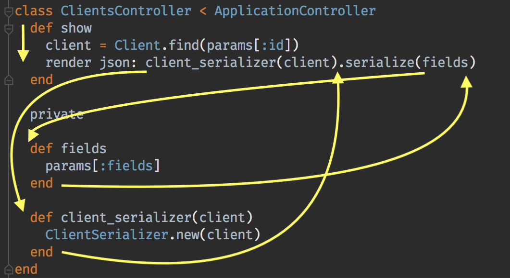

In my experience writing Ruby, a strong aversion to using local variables is something I have noticed again and again.
I would propose that in *most* scenarios this has several under-recognized drawbacks. The solution is easy:
**use local variables**. 

### Methods take more lines

This may sound obvious, but every method definition results in +3 extra lines in a class.

1. `def name` The method definition
1. `end` The method definition termination 
1. A line of whitespace that separates the methods

Lines of code are meaningless, right? No big deal. WRONG! You walked right into that one (grin).

Lines of code represent a maintenance burden. They **do** matter, as they can add up quickly and turn a class
that can be read easily in a single page into a long, choppy mess.

I consider this particularly egregious when a variable definition would have been a single line. A good general rule is
that if the number of added lines is more than the body of the definition itself, you are introducing more noise and
less signal in your code. That's a bad thing.

### Methods obscure linear readability

Another aspect of readability is the ability of a person reading the code to follow what's going on. The interpreter can
trivially follow a chain of methods and unroll that into a discrete sequence of instructions. PEOPLE, however, have a
MUCH easier time reading in a single top-to-bottom sweep. Here's an example:

```ruby
class ClientsController < ApplicationController
  def show
    client = Client.find(params[:id])
    render json: client_serializer(client).serialize(fields)
  end

  private

  def fields
    params[:fields]
  end

  def client_serializer(client)
    ClientSerializer.new(client)
  end
end
```

If you object that this is a contrived example, I took this almost verbatim from a real codebase. I actually simplified 
it for the sake of brevity. It doesn't take a lot of imagination for this to be a part of a larger class which only
makes the amount of indirection more confusing. When I talk about the ability for a human to read this, here is where
a person's eyes must go in order to read this code and fully understand what the `show` method does:



I concede that programmers get good at doing this sort of thing, but nevertheless I am convinced that it's far easier to
read that same code in this form:

```ruby
class ClientsController < ApplicationController
  def show
    client = Client.find(params[:id])
    client_serializer = ClientSerializer.new(client)
    render json: client_serializer.serialize(params[:fields])
  end
end
```

If you're counting that's 7 lines of code rather than 16 lines of code. The furthest your eye might have to jump up/down
is a single line. I cheated slightly in that I skipped creating a local variable entirely for `param[:fields]`, because
sometimes when you inline things you realize how little the label of a variable adds to understandability.

### How about memoization?

Another version of this that I see a lot is using it for sharing memoized instances between methods.

```ruby
class ClientsController < ApplicationController
  def show
    raise ActiveRecord::RecordNotFound unless client.present?
    render json: client_serializer.serialize(params[:fields])
  end

  private

  def client
    @client ||= Client.find_by(id: params[:id])
  end

  def client_serializer
    @client_serializer ||= ClientSerializer.new(client)
  end
end
```

This has all the same problems I already talked about, plus it adds statefulness and unclear method dependencies into
the mix.

It's harder to reason about state outside of the lexical scope. Since this memoization could be `nil`, it now depends on a
nil-check occurring before subsequent calls to `client` since `nil` is falsy, and therefore the database call could
occur multiple times despite the attempt at memoization. We can fix that, but it doesn't make the code more-clear:

```ruby
def client
  return @client if defined?(@client)
  @client = Client.find_by(id: params[:id])
end
```

Speaking of complexity, does `client_serializer` make a database call? Maybe. It depends on whether or not something
populated the memoized variable. Also why are we memoizing the serializer? Are multiple things using it? Is it expensive
to create? Well, it might be expensive if it has to make a database call. This code is just plain murkier than the
alternative:

```ruby
class ClientsController < ApplicationController
  def show
    client = Client.find_by(id: params[:id])
    raise ActiveRecord::RecordNotFound unless client.present?
    client_serializer = ClientSerializer.new(client)
    render json: client_serializer.serialize(params[:fields])
  end
end
```

Representing it this way might even make it clearer that you never need to allow a `nil` client and could use
ActiveRecord's `find` or `find_by!` to tighten this up. If you were looking at the `client` memoizing method
it's not-at-all clear whether that is the desired behavior in every place that used it.
 
### Exceptions

Sometimes it's important to re-use the same block of code from multiple entrypoints in your class. That's fair. Keep
in mind that some amount of minor duplication is ok, though. DRY is not about repeating lines of code, but about repeating
ideas. If you can't imagine extracting a small standalone class to represent that shared functionality, then you might
not need a method either. I am not suggesting all extracted methods be classes, just a perspective to have when thinking
about whether it truly belongs as a separate block of code.

### Why I wrote this

I have often seen the "only use extracted methods" approach in Ruby code, and never seen the "only use local variables"
approach (which I do *not* advocate). There's a middle path where using both extracted methods and local variables can
help to make your code more readable, more maintainable, and easier to reason about. My aim here is to provoke you to
think about it, and maybe tip the scales back into a better balance.
