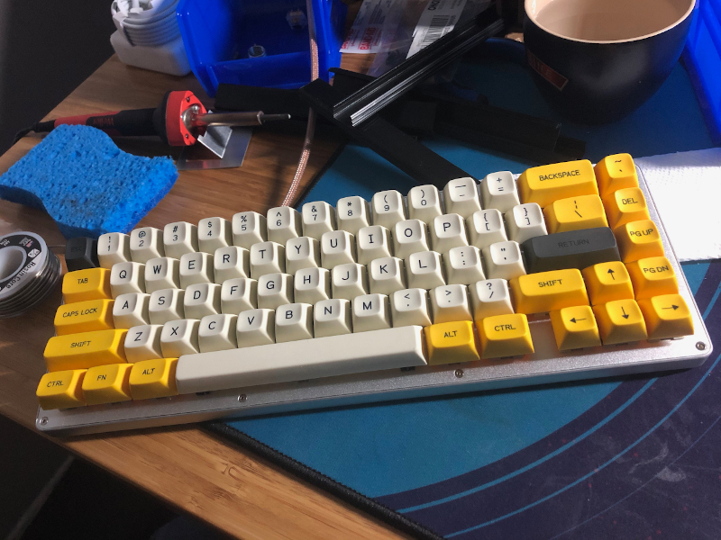
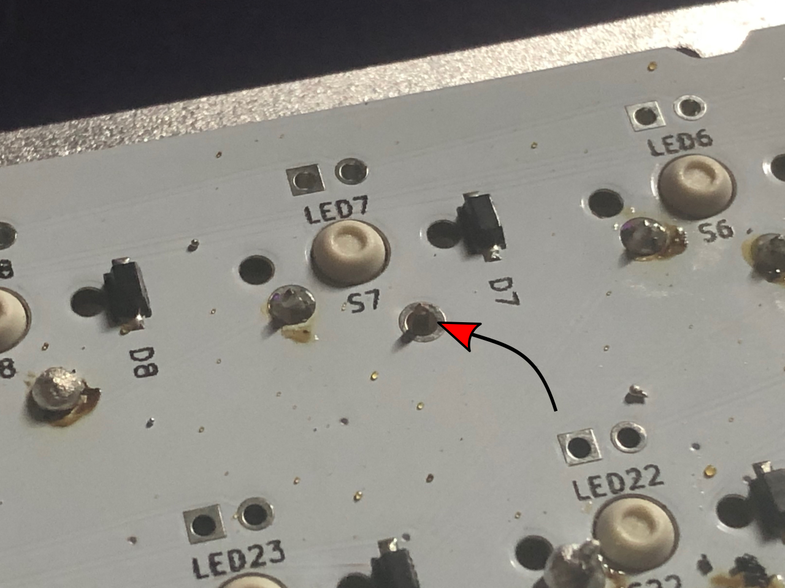
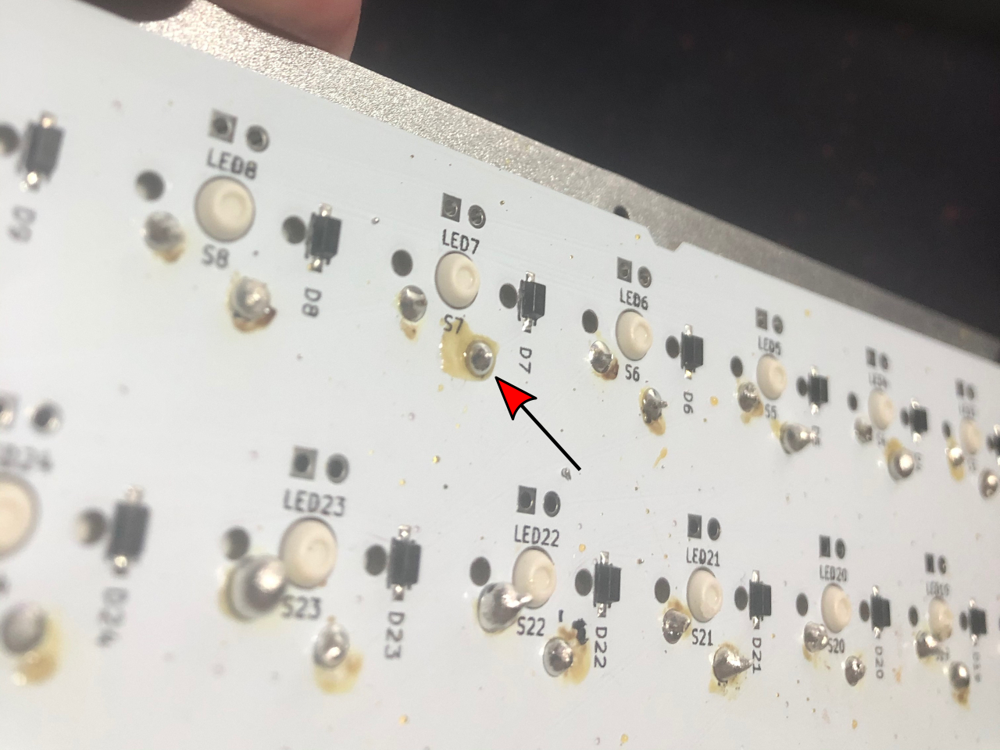
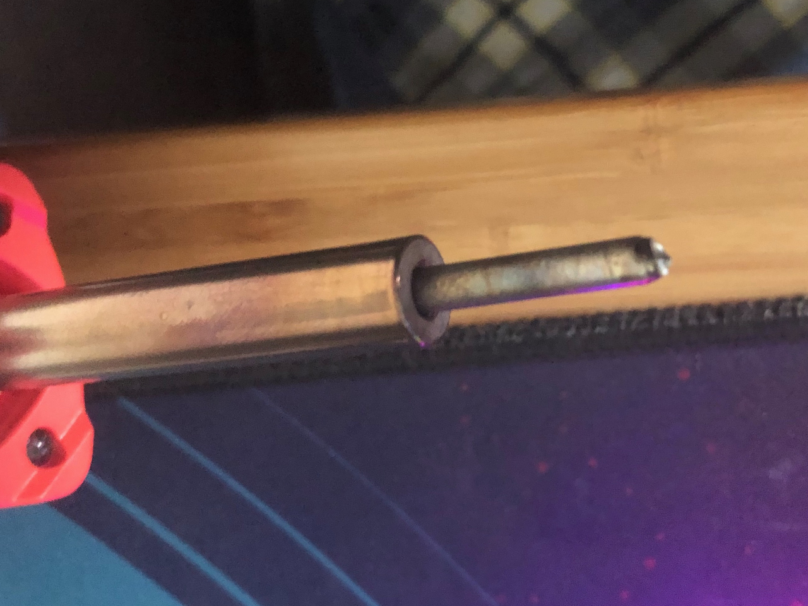

I wrote this on a forum that was not-necessarily technical, so I tried to be clear and not make assumptions about mechanical keyboard or electronics knowledge. The underlying theme is that this is an approachable project for beginners, like myself. Alright, strap in: this is a nerdy hobby.

I’m a programmer and engineering manager, so I’m on a computer all day. The keyboard is your interface to the computer and so naturally there’s a hobby around building and customizing your personal keyboard. You can buy pre-built keyboards to your specifications or you can buy kits that need varying levels of assembly. If you’re deep down the rabbit hole you can custom design your own or get into the production side. The more work you're willing put in to the assembly process, the more customization possibilities are available to you for your keyboard. As a hobby it’s also enjoyable to *make* something with your own hands and effort.

To start, I already had for myself a pre-built keyboard that has hot-swappable mechanical switches[2](#keyboard-terminology). Hot-swappable means that you can change out mechanical switches without soldering. I decided to go one step further into the hobby and obtain a keyboard kit (a case[4](#keyboard-terminology), a PCB[3](#keyboard-terminology)) that required soldering the switches into the board.  I did my research and shopped around, eventually ordering all the components I needed: the kit ([Input Club’s White Fox (Aria layout)](https://input.club/whitefox/)), mechanical switches[2](#keyboard-terminology) ([Holy Pandas](https://drop.com/buy/drop-invyr-holy-panda-mechanical-switches?utm_source=linkshare&referer=YUZ2PB)), and key caps[1](#keyboard-terminology)  ([Zambumon’s MT3 profile, Serika colorway](https://drop.com/buy/drop-zambumon-mt3-serika-custom-keycap-set?utm_source=linkshare&referer=YUZ2PB)).

The way a lot of these individual components are sold is through group buys where you commit to paying for an item before they are made. If enough people commit to buy them, they get manufactured. This means you must plan far ahead, as it may take months to for all the parts to arrive. Oh, and small batch manufacturing isn’t cheap either.

Anyway, months later I had everything ready and waiting for me to put together. Naturally, I procrastinated; it sat in a small stack of boxes next to my work desk for 6 more months. Finally, in early October 2020 I recommitted and put everything together.

Time for [some pictures](https://imgur.com/gallery/RvUlily)! Disclaimer: I didn’t take a whole lot of pics, or focus on photo quality, because I didn’t want to distract myself from the "DOING."

If you’ve read all this, looked at the pictures, then you may notice what I haven’t spoken to yet (even in pictures): **the soldering**. Why? Well… I'm not proud of that work. When I was taking pictures and putting together that album I purposefully omitted pictures of that to hide my shame.

The thing I *am* proud of is that **I did it** and that **it worked** - success, right? Almost.

It took an hour of me "driving" my new keyboard before I noticed something. There was a single key that wouldn't register - the `6` number key. Dang, I had to open the keyboard back up and fix a bad solder joint. There were so many bad solders it must be that, I thought. No problem, I was expecting something like this, and I even had extra switches if needed. A day later I opened the keyboard back up to fix the problem.

## The Soldering

At this point I also decided "what the hell," that I will take some pictures. I came around to the justifying that as embarrassing as it may be, sharing pictures of a job poorly-done might help this whole thing feel more-accessible to beginners like myself! I don't need to front that I'm great at everything - it's ok to be a beginner, and it's ok to have learning experiences. So. I opened up the keyboard, looked at the soldered connections on the back of the board and here's what I saw:

Ignoring the bad soldering for a moment, you can clearly see the problem to the bottom-right of `S7`. I completely missed soldering one of the switch contacts! THAT'S an easy fix - just have to solder it. Even "badly" would be better than "not at all."

Without re-assembling I went ahead and tested it by connecting the board to my computer and checking the `6` key. It works now, hurray! One lesson I took away here is that soldering a keyboard is more-forgiving than you might assume - I fully expected there to be more non-functioning switches[2](#keyboard-terminology), but surprisingly to me they all worked fine *if they were soldered at-all*.

Now that you've seen a couple pics I'll let you in on [the full gallery with more pictures of the soldered side of the PCB](https://imgur.com/gallery/02Jii3Q). Your wincing muscles are about to get a workout.

If you read the comments alongside the pics, my shame is palpable but I had a hard time articulating exactly why these look so bad to me. I *do* have some soldering experience, but I hadn't picked up a soldering iron in over 20 years. I know these are bad, but dredging up my basic knowledge enough to even explain why was tough. I've since had the opportunity to share these pics with other keyboard nerds and they really helped me to explain what's going on here, so I'll share a bit of that here.

A good solder joint on a PCB[3](#keyboard-terminology) looks mirror-shiny with a smooth, concave shape that covers the metal pad (shape-wise, for circular pads like these, a lot like a Hershey's Kiss). Most of these are.. not that!

Ross Reinhardt of [IndyHackers](http://www.indyhackers.org/)' `#mech_keys` Slack channel's analysis was one of the best, most-concise explanations:

> I think the blobs in that case look like they might be because the “trace” on the board didn’t get warm enough, so the solder didn’t really bond with it but kind of beaded up on top. Sounds like the inexpensive iron and dull tip that probably made it difficult! The dull tip is probably bridging right over the trace as it rests on the pin and the board… On the upside, if you get an iron with a better tip you could probably just hit those blobs again making sure the trace heats up as well and it will correct itself 
>
> That “dull” look to them (instead of appearing shiny) is characteristic of a “cold” solder joint (one that didn’t get warm enough to bond to all surfaces).

He nails a lot of what went-on here, and even a big part of the why - I skimped on a cheap $15 soldering iron, and part of my bumbling inexperience led to the stylus-shaped tip corroding into a nub that was extremely hard to work with by the end of the project.

I'd have made some bad solders no matter what, especially in the first handful as I was fumbling to recall technique I'd learned 20+ years ago, but I gave myself a handicap by cheaping out on that soldering iron. A practiced hand could have laid down great solders with that iron, but I was far from that and a higher-quality more-forgiving iron would have helped me some.

My strategy the whole project was to make one whole first pass no matter how ugly and then go back and fix any that weren't working. Unfortunately my soldering iron tip was hot garbage at the end and I had no desire to go back for cosmetic cleanups, which is why I left them like this - they worked!

So if they work, why are they bad? Well cosmetics, sure, but also the cold solders and blobs MAY become flaky over time since there's not a good bond, so there is a risk I will be revisiting these in the future. I'm ok with that, at least for now.

I do know that when I do this again I will do a LOT better, so it was good for learning and I get to enjoy a sweet keyboard!

## My Recommendations For Other Beginners 

If this inspires any folks to try their hand at anything similar my recommendations would be:

* Spend more than the bare minimum on your soldering iron. A friend whom I consulted had this to say: "i splurged for a Hakko FX888D soldering station and it upgraded my soldering skills to ninja level […] im still definitely not good at soldering. but perfect temp control and really nice tips make it sooo much easier"
* Watch a few [soldering 101 YouTube videos](https://www.youtube.com/watch?v=oqV2xU1fee8) to familiarize yourself with the technique. I was cocky because I'd done it before and only watched one short one, but I would have benefited from watching at least one or two more.
* You can practice on something else first! There's tons of pretty-nice practice kits for less than $10. Search your favorite shopping site for "practice soldering board kit"

#### keyboard terminology

1. **key caps**: The plastic tops of your keys, typically having the letters/numbers/functions printed on them.
1. **switches**: The springy/clicky thing sitting under the key caps giving the keys their "feel". This is the moving part.
1. **PCB**: **P**rinted **C**ircuit **B**oard. This is the "brains" of the keyboard, switches connect to the board and then the board sits in the case. The PCB has one or more ports to connect the keyboard to computers or other peripherals.
1. **Case**: The housing of the keyboard - mostly aesthetic, but contributes to the feel and sound of a keyboard.
